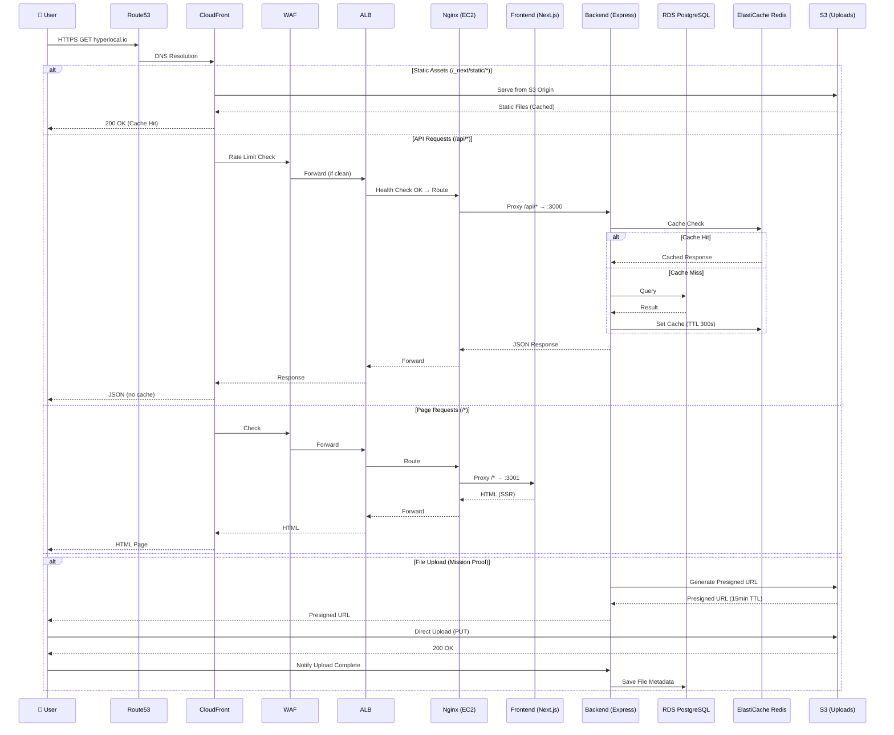

# HyperLocal Mission Platform — 클라우드 인프라 아키텍처 설계서

> **버전:** v1.0 | **작성자:** DevOps Engineer | **기준:** MVP 베타 런칭 D-2주

---

## 1. AWS 아키텍처 다이어그램

### 1-1. Production 전체 아키텍처

```mermaid
graph TB
    subgraph Internet["🌐 Internet"]
        User["👤 End Users<br/>(Participants / Clients)"]
        Operator["🔧 Operators<br/>(Admin)"]
        GHA["⚙️ GitHub Actions<br/>CI/CD Runner"]
    end

    subgraph AWS_Global["☁️ AWS Global Edge"]
        R53["Route 53<br/>DNS + Health Check<br/>hyperlocal.io"]
        CF["CloudFront<br/>CDN Distribution<br/>Static Assets / Images"]
        WAF["AWS WAF<br/>Web Application Firewall<br/>(Rate Limit / IP Block)"]
        ACM["ACM<br/>SSL Certificate<br/>(*.hyperlocal.io)"]
    end

    subgraph S3_Global["📦 S3 Buckets (Global)"]
        S3_Static["s3://hyperlocal-static-prod<br/>Next.js Static Assets<br/>Public Read"]
        S3_Upload["s3://hyperlocal-uploads-prod<br/>Mission Proof Images/Videos<br/>Private + Presigned URL"]
        S3_Backup["s3://hyperlocal-backup-prod<br/>DB Snapshots / Logs<br/>Versioning ON"]
    end

    subgraph VPC["🔒 VPC — vpc-hyperlocal-prod (ap-northeast-2) CIDR: 10.0.0.0/16"]
        subgraph AZ_A["Availability Zone A (ap-northeast-2a)"]
            subgraph PubSub_A["Public Subnet A — 10.0.1.0/24"]
                ALB_A["Application Load Balancer<br/>(ALB) — Public Facing"]
                NAT_A["NAT Gateway A<br/>(Primary)"]
                BAS["Bastion Host<br/>t3.micro<br/>SSM Session Manager"]
            end
            subgraph AppSub_A["Private App Subnet A — 10.0.11.0/24"]
                EC2_A["EC2 t3.medium<br/>App Server A<br/>Docker Compose<br/>Backend + Frontend + Nginx"]
            end
            subgraph DBSub_A["Private DB Subnet A — 10.0.21.0/24"]
                RDS_Primary["RDS PostgreSQL 15<br/>db.t3.medium — Primary<br/>Multi-AZ Master"]
                EC_Primary["ElastiCache Redis 7<br/>cache.t3.micro — Primary"]
            end
        end

        subgraph AZ_B["Availability Zone B (ap-northeast-2c)"]
            subgraph PubSub_B["Public Subnet B — 10.0.2.0/24"]
                NAT_B["NAT Gateway B<br/>(Standby)"]
            end
            subgraph AppSub_B["Private App Subnet B — 10.0.12.0/24"]
                EC2_B["EC2 t3.medium<br/>App Server B<br/>Docker Compose<br/>(Staging / Standby)"]
            end
            subgraph DBSub_B["Private DB Subnet B — 10.0.22.0/24"]
                RDS_Standby["RDS PostgreSQL 15<br/>db.t3.medium — Standby<br/>Multi-AZ Replica"]
                EC_Replica["ElastiCache Redis 7<br/>cache.t3.micro — Replica"]
            end
        end

        subgraph Monitoring["📊 Monitoring Layer — Private Subnet 10.0.31.0/24"]
            CW["CloudWatch<br/>Logs + Metrics + Alarms"]
            CW_Agent["CloudWatch Agent<br/>(각 EC2 설치)"]
        end
    end

    subgraph CICD["🔄 CI/CD Layer"]
        ECR["ECR<br/>Elastic Container Registry<br/>backend / frontend 이미지"]
        SSM_PS["SSM Parameter Store<br/>Secrets / Env Vars"]
        IAM["IAM Roles<br/>EC2 / GHA / S3 권한"]
    end

    %% Traffic Flow
    User -->|HTTPS| R53
    Operator -->|HTTPS| R53
    R53 -->|DNS Route| CF
    R53 -->|DNS Route| ALB_A
    CF -->|Origin| S3_Static
    CF -->|Origin| ALB_A
    WAF --> ALB_A
    ACM --> ALB_A
    ACM --> CF

    ALB_A --> EC2_A
    ALB_A --> EC2_B

    EC2_A --> RDS_Primary
    EC2_A --> EC_Primary
    EC2_A --> S3_Upload
    EC2_B --> RDS_Primary
    EC2_B --> EC_Primary

    RDS_Primary -.->|Sync Replication| RDS_Standby
    EC_Primary -.->|Replication| EC_Replica

    EC2_A --> NAT_A
    EC2_B --> NAT_B
    NAT_A -->|Outbound| Internet
    NAT_B -->|Outbound| Internet

    GHA -->|Push Image| ECR
    GHA -->|SSH / SSM Deploy| EC2_A
    GHA -->|SSH / SSM Deploy| EC2_B

    ECR -->|Pull Image| EC2_A
    ECR -->|Pull Image| EC2_B
    SSM_PS -->|Env Inject| EC2_A
    SSM_PS -->|Env Inject| EC2_B

    CW_Agent --> CW
    EC2_A --> CW_Agent
    EC2_B --> CW_Agent
    RDS_Primary --> CW
    ALB_A --> CW

    S3_Upload --> CF
    S3_Static --> CF
    RDS_Primary -->|Automated Backup| S3_Backup

    BAS -->|SSM Tunnel| EC2_A
    BAS -->|SSM Tunnel| EC2_B
    BAS -->|DB Access| RDS_Primary

    style VPC fill:#1a1a2e,stroke:#4a90d9,color:#fff
    style AWS_Global fill:#0d2137,stroke:#ff9900,color:#fff
    style S3_Global fill:#0d3320,stroke:#4CAF50,color:#fff
    style CICD fill:#1a0d2e,stroke:#9c27b0,color:#fff
    style Internet fill:#1a1a1a,stroke:#888,color:#fff
    style Monitoring fill:#1a1a00,stroke:#ffd700,color:#fff
```



### 1-2. 네트워크 트래픽 흐름 상세



---

## 2. AWS 서비스 목록 및 선택 근거

### 2-1. 컴퓨팅 — EC2 선택 근거

```
결정: EC2 t3.medium (Docker Compose 기반)
      ECS / Lambda 미채택
```

#### 선택 비교표

| 항목 | EC2 + Docker Compose ✅ | ECS Fargate | Lambda |
|------|------------------------|-------------|--------|
| **MVP 복잡도** | 낮음 (기존 팀 역량) | 중간 | 높음 (Cold Start, 설계 변경) |
| **기술 스택 적합성** | Docker Compose 명세 확정 | 별도 Task 정의 필요 | Express.js 리팩터 필요 |
| **비용 (MVP 규모)** | ~$35/월 | ~$80/월 | 트래픽 기반 (예측 어려움) |
| **WebSocket 지원** | ✅ (P2 실시간 알림 대비) | ✅ | ❌ |
| **운영 난이도** | 낮음 | 중간 | 높음 |
| **스케일링** | 수동 / ASG | 자동 | 자동 |
| **장기 전환 경로** | → ECS (v2 고도화) | - | - |

#### 선택 이유
```
1. PM 지시서 기술스택 확정: Docker Compose v2 기반 명세
2. MVP D-2주 제약: 팀 학습 곡선 최소화
3. 월 MAU 500명 규모: t3.medium 충분 (과잉 설계 방지)
4. v1.1 → ECS 마이그레이션 경로 확보 (Docker Image 호환)
```

#### EC2 상세 스펙

```yaml
# Production App Servers
ec2_app_prod:
  instance_type: t3.medium
  vcpu: 2
  memory: 4GB
  storage:
    root: 30GB gp3  # OS + Docker Images
    data: 50GB gp3  # Docker Volumes (DB 백업, 로그)
  os: Ubuntu 22.04 LTS
  count: 1 (MVP) → 2 (Auto Scaling 대비 Launch Template 준비)
  placement: Private App Subnet
  iam_role: hyperlocal-ec2-app-role

# Bastion Host
ec2_bastion:
  instance_type: t3.micro
  storage: 8GB gp3
  os: Ubuntu 22.04 LTS
  access: SSM Session Manager Only (SSH 포트 비개방)
  auto_shutdown: 업무시간 외 자동 중지 (비용 절감)
```

### 2-2. RDS — PostgreSQL 15

```yaml
rds_config:
  engine: PostgreSQL 15.x
  instance_class: db.t3.medium  # 2 vCPU, 4GB RAM
  storage:
    type: gp3
    allocated: 100GB
    max_allocated: 500GB  # Storage Autoscaling
    iops: 3000
  
  # 고가용성 설정
  multi_az: true           # MVP부터 활성화 (데이터 보호)
  availability_zones:
    primary: ap-northeast-2a
    standby: ap-northeast-2c
  
  # 백업 설정
  backup:
    retention_period: 7days
    backup_window: "03:00-04:00"  # KST 12:00-13:00 (트래픽 최저)
    snapshot_export: S3 (hyperlocal-backup-prod)
  
  # 보안
  encryption: true (AES-256)
  ca_cert: rds-ca-2019
  deletion_protection: true
  publicly_accessible: false   # Private Subnet Only
  
  # 성능 튜닝
  parameter_group:
    max_connections: 200
    shared_buffers: 1GB
    effective_cache_size: 3GB
    work_mem: 16MB
    maintenance_work_mem: 256MB
    log_min_duration_statement: 1000ms  # Slow Query 로깅
  
  # 모니터링
  performance_insights: true (무료 7일 보존)
  enhanced_monitoring: 60s interval
  cloudwatch_logs:
    - postgresql
    - upgrade

# Security Group Rules
rds_sg:
  inbound:
    - port: 5432
      source: ec2_app_sg   # EC2 App 서버만 접근
      description: "App Server PostgreSQL Access"
    - port: 5432
      source: bastion_sg   # Bastion 경유 관리자 접근
      description: "Bastion DB Admin Access"
  outbound: []  # DB는 아웃바운드 불필요
```

### 2-3. ElastiCache Redis 7

```yaml
elasticache_config:
  engine: Redis 7.x
  node_type: cache.t3.micro  # MVP (MAU 500 기준)
  num_nodes: 2  # Primary + Replica
  
  # 용도별 DB 분리
  databases:
    db_0: Session Store (JWT Refresh Token)
    db_1: API Response Cache (Mission List, User Profile)
    db_2: Rate Limiting Counter
    db_3: Job Queue (P1 단계 - 알림 큐 대비)
  
  # 설정
  at_rest_encryption: true
  in_transit_encryption: true
  auth_token: SSM Parameter Store에서 주입
  
  backup:
    snapshot_retention: 3days
    snapshot_window: "04:00-05:00"
  
  # TTL 정책
  ttl_policy:
    session: 86400s  # 24시간
    api_cache: 300s  # 5분
    rate_limit: 3600s  # 1시간
```

### 2-4. S3 버킷 구성

```yaml
s3_buckets:

  # 1. 미션 인증 이미지/영상 저장
  hyperlocal-uploads-prod:
    region: ap-northeast-2
    access: Private (Presigned URL 방식)
    versioning: true
    lifecycle:
      - id: "move-to-ia"
        transition: 90days → STANDARD_IA
        description: "90일 이후 접근 빈도 낮은 콘텐츠"
      - id: "archive"
        transition: 365days → GLACIER
        description: "1년 이후 아카이브"
      - id: "delete-incomplete"
        abort_incomplete: 7days
        description: "미완료 멀티파트 업로드 정리"
    cors:
      allowed_origins:
        - https://hyperlocal.io
        - https://staging.hyperlocal.io
      allowed_methods: [GET, PUT]  # Presigned URL 업로드
      max_age_seconds: 3600
    encryption: SSE-S3 (AES-256)
    public_access_block: ALL BLOCKED
    
    # 파일 크기/타입 제한 (Presigned URL 조건)
    upload_conditions:
      image:
        max_size: 10MB
        content_types: [image/jpeg, image/png, image/webp, image/heic]
      video:
        max_size: 200MB
        content_types: [video/mp4, video/quicktime]
    
    # 폴더 구조
    prefix_structure:
      missions: "missions/{mission_id}/{participant_id}/{timestamp}_{filename}"
      profiles: "profiles/{user_id}/{filename}"
      reports: "reports/{client_id}/{month}/{report_id}.pdf"

  # 2. Next.js 정적 에셋
  hyperlocal-static-prod:
    region: ap-northeast-2
    access: Public Read (CloudFront Origin)
    versioning: false
    cache_control: "public, max-age=31536000, immutable"  # 1년
    prefix_structure:
      - "_next/static/"   # JS/CSS 번들
      - "icons/"
      - "images/"

  # 3. 백업 및 로그
  hyperlocal-backup-prod:
    region: ap-northeast-2
    access: Private (IAM Role Only)
    versioning: true
    mfa_delete: true  # 실수 삭제 방지
    lifecycle:
      - id: "db-backup-retention"
        prefix: "rds-snapshots/"
        expiration: 30days
      - id: "log-retention"
        prefix: "logs/"
        expiration: 90days
      - id: "archive-logs"
        prefix: "logs/"
        transition: 30days → GLACIER
    replication:
      destination: hyperlocal-backup-dr  # 재해복구용 (ap-northeast-1 도쿄)
      status: Enabled

  # 4. DR 버킷 (도쿄)
  hyperlocal-backup-dr:
    region: ap-northeast-1
    access: Private
    versioning: true
    purpose: Cross-Region Replication 대상
```

### 2-5. CloudFront CDN 설정

```yaml
cloudfront_distributions:

  # Main Distribution
  hyperlocal-main-cf:
    domain_aliases:
      - hyperlocal.io
      - www.hyperlocal.io
    ssl_certificate: ACM (ap-northeast-1 ← CloudFront 필수 리전)
    http_version: http2and3
    price_class: PriceClass_200  # 북미+유럽+아시아 (한국 포함)
    
    origins:
      alb_origin:
        domain: alb-prod.ap-northeast-2.elb.amazonaws.com
        protocol: HTTPS
        custom_headers:
          X-CloudFront-Secret: ${SSM:/hyperlocal/cf-secret}  # Origin 직접 접근 차단
      
      s3_static_origin:
        domain: hyperlocal-static-prod.s3.ap-northeast-2.amazonaws.com
        origin_access: OAC (Origin Access Control)
      
      s3_upload_origin:
        domain: hyperlocal-uploads-prod.s3.ap-northeast-2.amazonaws.com
        origin_access: OAC
    
    cache_behaviors:
      # 정적 에셋 — 강력 캐시
      - path_pattern: "/_next/static/*"
        origin: s3_static_origin
        cache_policy: CachingOptimized
        ttl:
          default: 31536000  # 1년 (파일명 해시 포함이라 안전)
          max: 31536000
        compress: true
      
      # 업로드 이미지 — 중간 캐시
      - path_pattern: "/uploads/*"
        origin: s3_upload_origin
        cache_policy: CachingOptimized
        ttl:
          default: 86400   # 24시간
          max: 604800      # 7일
        compress: false  # 이미지/영상은 이미 압축됨
      
      # API — 캐시 없음
      - path_pattern: "/api/*"
        origin: alb_origin
        cache_policy: CachingDisabled
        allowed_methods: [GET, HEAD, OPTIONS, PUT, POST, PATCH, DELETE]
        forward_headers: [Authorization, Content-Type, Accept]
        ttl:
          default: 0
          max: 0
      
      # SSR 페이지 — 짧은 캐시
      - path_pattern: "/*"
        origin: alb_origin
        cache_policy: Custom
        ttl:
          default: 0      # SSR은 캐시 안 함 (기본)
          max: 30         # 정적 페이지는 30초까지
    
    # WAF 연동
    web_acl_id: ${WAF_ACL_ARN}
    
    # 에러 페이지 처리
    custom_error_responses:
      - error_code: 404
        response_code: 200
        response_page_path: "/404"  # Next.js 핸들링
      - error_code: 503
        response_code: 503
        response_page_path: "/maintenance"
    
    logging:
      bucket: hyperlocal-backup-prod
      prefix: "cloudfront-logs/"

  # Upload Presigned URL용 별도 도메인 (선택사항)
  hyperlocal-uploads-cf:
    domain_aliases:
      - uploads.hyperlocal.io
    origins:
      s3_upload_origin: ...
    comment: "미션 인증 이미지 서빙 전용"
```

### 2-6. VPC 네트워크 구성

```yaml
vpc:
  name: vpc-hyperlocal-prod
  cidr: 10.0.0.0/16
  region: ap-northeast-2 (Seoul)
  dns_hostnames: true
  dns_resolution: true

subnets:
  # Public Subnets (ALB, NAT Gateway)
  public_a:
    cidr: 10.0.1.0/24
    az: ap-northeast-2a
    resources: [ALB, NAT Gateway A, Bastion Host]
    auto_assign_public_ip: true
  
  public_b:
    cidr: 10.0.2.0/24
    az: ap-northeast-2c
    resources: [ALB (Multi-AZ), NAT Gateway B]
    auto_assign_public_ip: true

  # Private App Subnets (EC2 App Servers)
  private_app_a:
    cidr: 10.0.11.0/24
    az: ap-northeast-2a
    resources: [EC2 App A]
    auto_assign_public_ip: false
    route_table: → NAT Gateway A
  
  private_app_b:
    cidr: 10.0.12.0/24
    az: ap-northeast-2c
    resources: [EC2 App B (Staging/Standby)]
    auto_assign_public_ip: false
    route_table: → NAT Gateway B

  # Private DB Subnets (RDS, ElastiCache)
  private_db_a:
    cidr: 10.0.21.0/24
    az: ap-northeast-2a
    resources: [RDS Primary, ElastiCache Primary]
    auto_assign_public_ip: false
    route_table: local only  # NAT 없음 (DB는 외부 통신 불필요)
  
  private_db_b:
    cidr: 10.0.22.0/24
    az: ap-northeast-2c
    resources: [RDS Standby, ElastiCache Replica]
    auto_assign_public_ip: false
    route_table: local only

  # Private Monitoring Subnet
  private_monitoring:
    cidr: 10.0.31.0/24
    az: ap-northeast-2a
    resources: [CloudWatch Agent, 향후 Prometheus]
    route_table: → NAT Gateway A

internet_gateway:
  name: igw-hyperlocal-prod
  attached_to: vpc-hyperlocal-prod

security_groups:
  
  alb_sg:
    name: sg-hyperlocal-alb
    inbound:
      - port: 443, source: 0.0.0.0/0 (CloudFront IP Ranges만 허용 권장)
      - port: 80, source: 0.0.0.0/0 (→ 443 Redirect)
    outbound:
      - port: all, destination: ec2_app_sg
  
  ec2_app_sg:
    name: sg-hyperlocal-ec2-app
    inbound:
      - port: 80, source: alb_sg      # Nginx (HTTP)
      - port: 443, source: alb_sg     # Nginx (HTTPS)
      - port: 22, source: bastion_sg  # SSH (Bastion 경유만)
    outbound:
      - port: 5432, destination: rds_sg
      - port: 6379, destination: cache_sg
      - port: 443, destination: 0.0.0.0/0  # AWS API, ECR Pull
      - port: 80, destination: 0.0.0.0/0   # Package 업데이트
  
  rds_sg:
    name: sg-hyperlocal-rds
    inbound:
      - port: 5432, source: ec2_app_sg
      - port: 5432, source: bastion_sg
    outbound: []
  
  cache_sg:
    name: sg-hyperlocal-cache
    inbound:
      - port: 6379, source: ec2_app_sg
    outbound: []
  
  bastion_sg:
    name: sg-hyperlocal-bastion
    inbound:
      - port: 443, source: 0.0.0.0/0  # SSM (HTTPS)
      # SSH 22 포트 비개방 (SSM Session Manager 사용)
    outbound:
      - port: 5432, destination: rds_sg
      - port: 22, destination: ec2_app_sg
      - port: 443, destination: 0.0.0.0/0

# VPC Endpoints (Private 통신으로 비용 절감 + 보안 강화)
vpc_endpoints:
  - name: vpce-s3
    service: com.amazonaws.ap-northeast-2.s3
    type: Gateway  # 무료
    route_tables: [private_app_a, private_app_b, private_db_a, private_db_b]
  
  - name: vpce-ecr-api
    service: com.amazonaws.ap-northeast-2.ecr.api
    type: Interface  # $7.2/월
    subnets: [private_app_a, private_app_b]
  
  - name: vpce-ecr-dkr
    service: com.amazonaws.ap-northeast-2.ecr.dkr
    type: Interface  # $7.2/월
    subnets: [private_app_a, private_app_b]
  
  - name: vpce-ssm
    service: com.amazonaws.ap-northeast-2.ssm
    type: Interface
    subnets: [private_app_a, private_app_b]
  
  - name: vpce-logs
    service: com.amazonaws.ap-northeast-2.logs
    type: Interface
    subnets: [private_app_a, private_app_b]

# Network ACL (서브넷 레벨 방어)
nacl:
  private_db:
    inbound:
      - rule: 100, port: 5432, source: 10.0.11.0/24, action: ALLOW
      - rule: 110, port: 5432, source: 10.0.12.0/24, action: ALLOW
      - rule: 120, port: 6379, source: 10.0.11.0/24, action: ALLOW
      - rule: 130, port: 6379, source: 10.0.12.0/24, action: ALLOW
      - rule: 32766, all, DENY  # 기타 모두 차단
    outbound:
      - rule: 100, all, destination: 10.0.11.0/24, ALLOW
      - rule: 110, all, destination: 10.0.12.0/24, ALLOW
```

---

## 3. 환경별 설정 (dev / staging / production)

### 3-1. 환경 전략 개요

```
┌─────────────────────────────────────────────────────────────────┐
│  Branch Strategy                                                 │
│                                                                  │
│  feature/* ──PR──▶ develop ──▶ staging ──▶ main (production)    │
│                       │            │           │                 │
│                    CI Tests   Auto Deploy   Manual Approve       │
│                    (Local)    (EC2 B)       (EC2 A)              │
└─────────────────────────────────────────────────────────────────┘
```

### 3-2. 환경별 리소스 비교표

| 항목 | Development | Staging | Production |
|------|------------|---------|------------|
| **실행 위치** | 개발자 로컬 (Docker Compose) | EC2 t3.medium (Private App B) | EC2 t3.medium (Private App A) |
| **도메인** | localhost:3000/3001 | staging.hyperlocal.io | hyperlocal.io |
| **DB** | Docker PostgreSQL 컨테이너 | RDS t3.micro (별도) | RDS t3.medium Multi-AZ |
| **Redis** | Docker Redis 컨테이너 | ElastiCache t3.micro | ElastiCache t3.